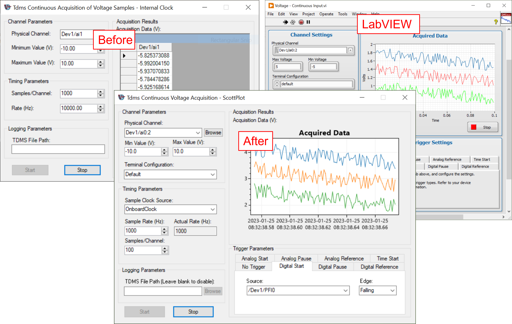

# DotNet Examples for NI Device Drivers

### Description ###
This repository provides additional examples for [.NET Resources for NI Hardware and Software](https://www.ni.com/en-ca/support/documentation/supplemental/13/national-instruments--net-support.html).

#### Existing Resources for NI-DAQmx ####
- [Using NI-DAQmx in Text Based Programming Environments](https://www.ni.com/en-ca/support/documentation/supplemental/21/using-ni-daqmx-in-text-based-programming-environments.html)
- [Using DAQmx in Visual Studio .NET With or Without Measurement Studio](https://knowledge.ni.com/KnowledgeArticleDetails?id=kA03q000000YHdcCAG&l=en-CA)

### Dependencies ###
- [ScottPlot.NET](https://scottplot.net/) (Install the [ScottPlot.WinForms](https://www.nuget.org/packages/ScottPlot.WinForms) NuGet package)

### Illustration ###

### Feedback and Contact ###
If you encounter a problem, or if you have suggestions for a future revision, please feel free to submit a ticket in the [Issue](https://github.com/ZhiYang-Ong/dotnet-ni-examples/issues) tab.
